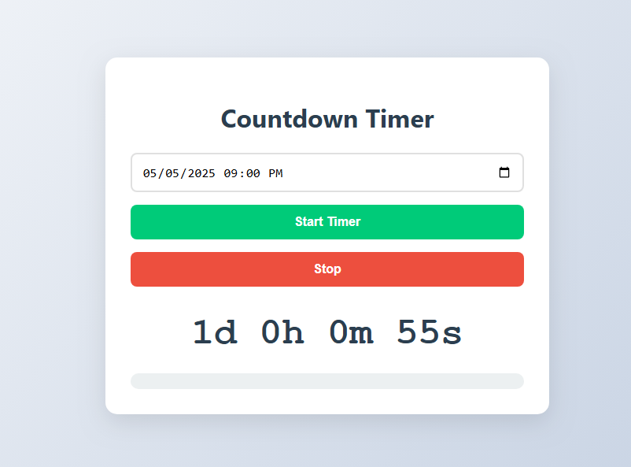

# ⏳ Countdown Timer App

A beautiful, responsive countdown timer built with vanilla JavaScript. Perfect for tracking important events, deadlines, or special occasions.



## ✨ Features

- 🎯 Set target date/time with datetime picker
- ⏱️ Live countdown display (days, hours, minutes, seconds)
- 📊 Visual progress bar that updates in real-time
- 🔔 Time's up notification
- ⏸️ Start/stop functionality
- 📱 Fully responsive design

## 🛠️ Technologies Used

- **Frontend**: HTML5, CSS3, JavaScript (ES6+)
- **Styling**: CSS Flexbox + custom animations
- **No dependencies**: Pure vanilla JS implementation

## Installation

No installation required! The app runs directly in the browser.

1. Clone this repository:
   ```bash
   git clone https://github.com/Philani56/Countdown-Timer-App
   ```
## 🤝 Contributing

Contributions are welcome! If you have suggestions or improvements, feel free to open an issue or submit a pull request.

## 📜 License

This project is licensed under the MIT License - see the LICENSE file for details.

## 📧 Contact

For any inquiries, questions, or feedback, please reach out to:

- Email: khumalophilani580@gmail.com
- LinkedIn: https://www.linkedin.com/in/nhlakanipho-philani-khumalo-679726224/

Feel free to connect with me on social media or via email for more information!
